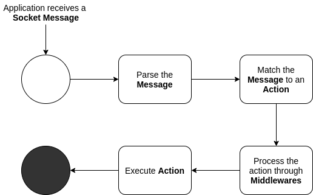

# How it works

Here is how it works:

Visit this video to understand with an example of how to route socket messages:

[Routing Socket Messages](https://www.youtube.com/embed/qHZpSGErR3M ':include :type=iframe ')

Next: [Quick Start](quickstart.md)
