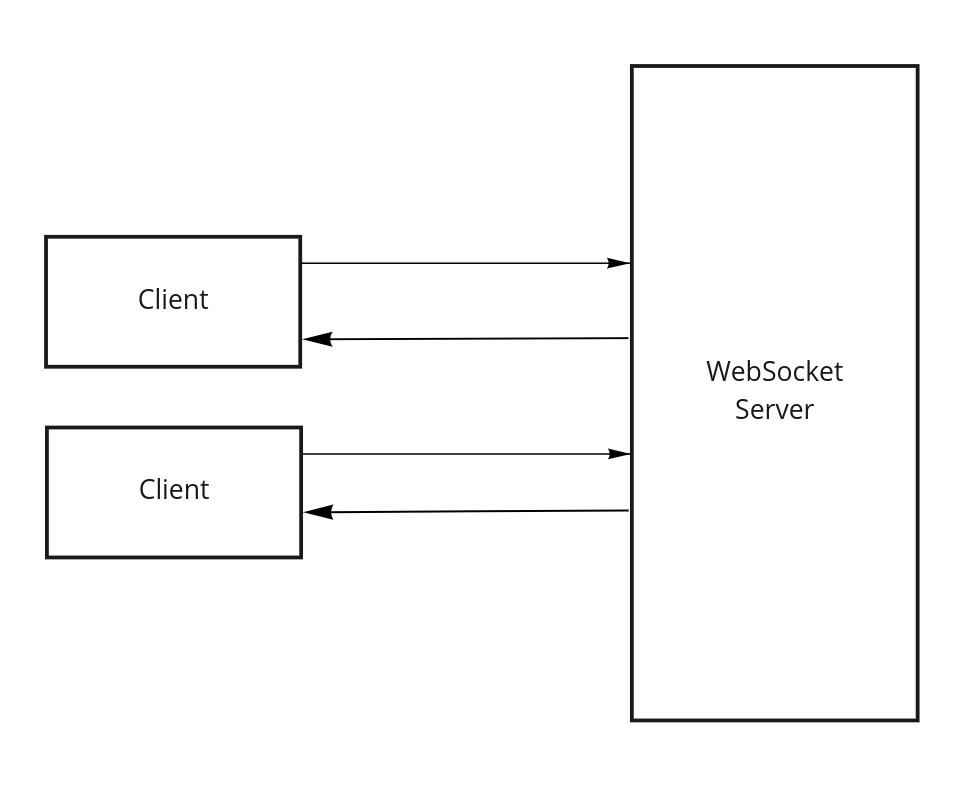
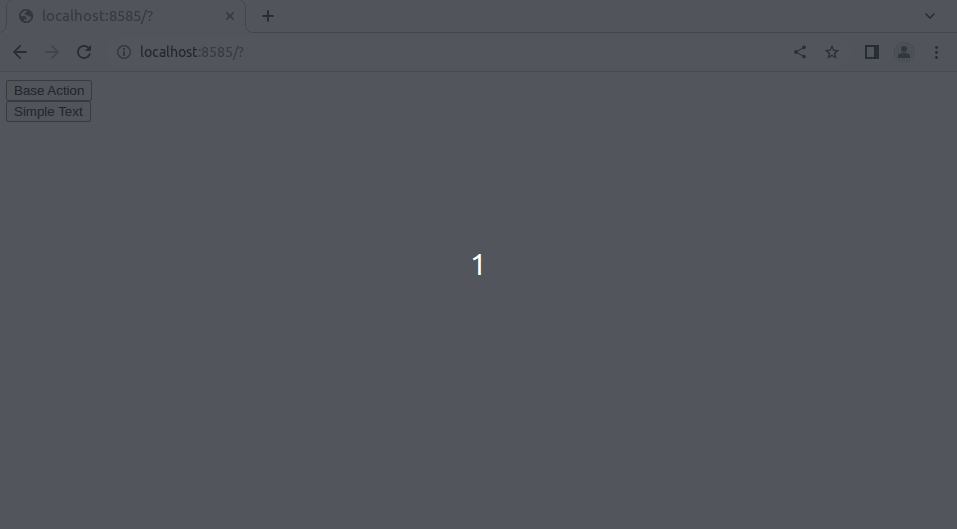
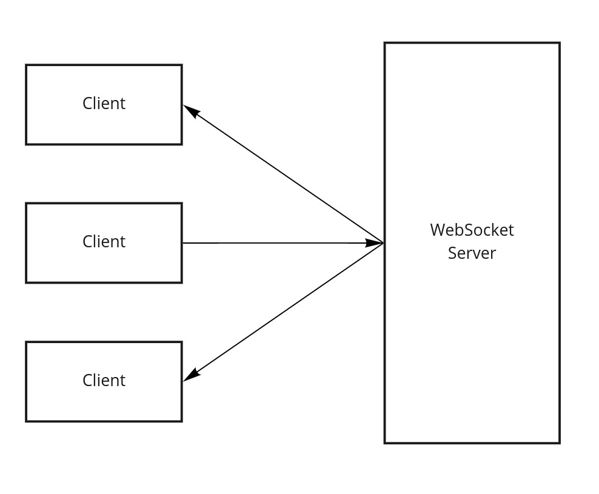
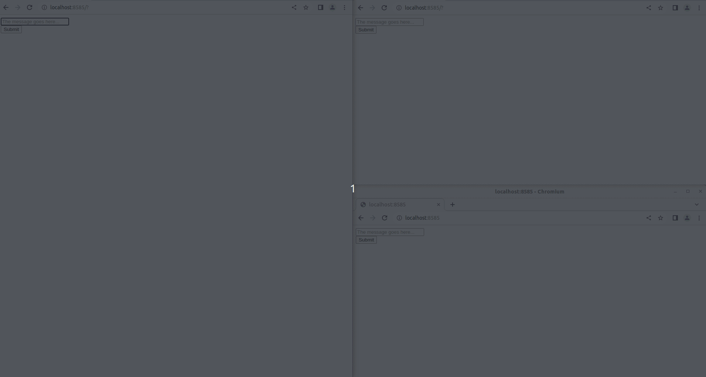
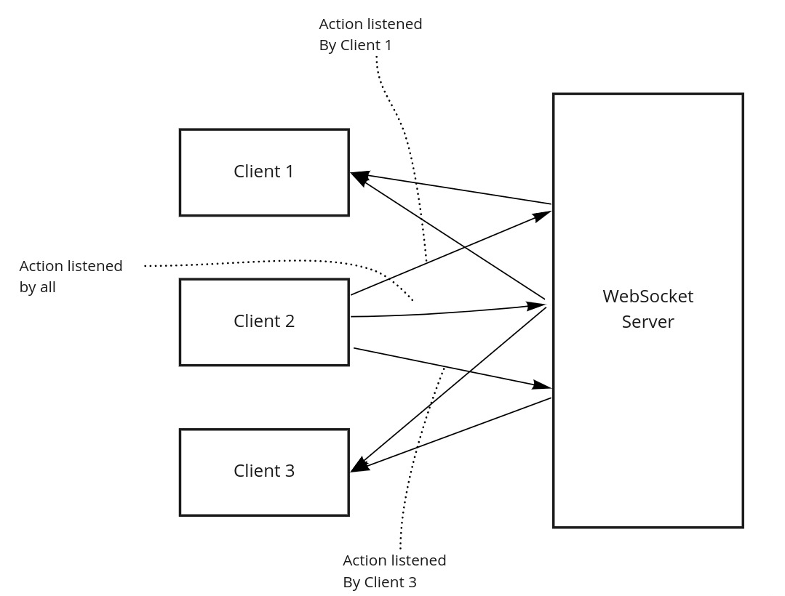
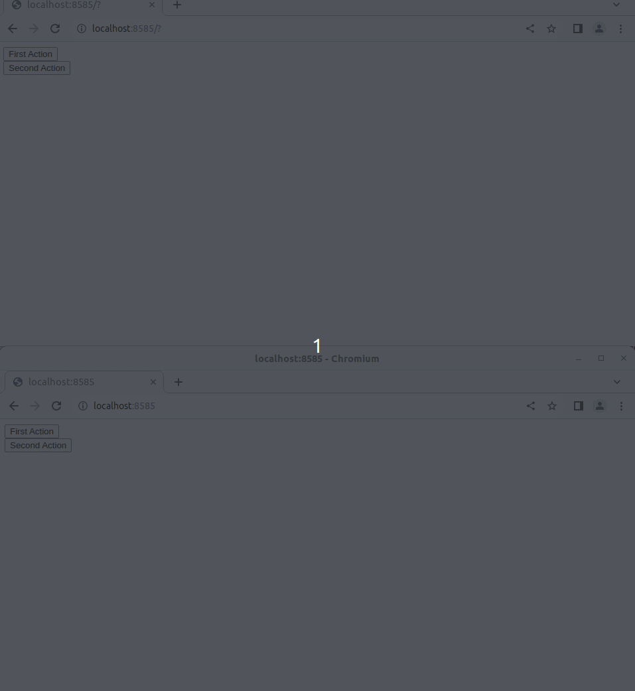

# Usage

> **Prerequisites**
> - The message must contain the action key corresponding to the action being triggered. e.g. `{action: 'broadcast-action'}`.
> - If a simple non-JSON string is sent, it will be considered a "ping/pong", responding with the same message that was sent.

Following we have 4 examples:

**Case 1**: The simple case: messages happen in ping/ping fashion between client and server and won't broadcast to other clients.

**Case 2**: The channel case: messages get broadcasted to all other clients within the same channel.

**Case 3**: The listener case: where clients can filter which messages (by action) they will receive.

**Case 4**: Associate an application user id with a connection (fd).

## Case 1: Simple Use

<p align="center">

</p>

At this example the user will receive back a real-time messages from the server after sending a message.

At this library, there is the presumption that the socket message has a *JSON* format, if not, the `Conveyor\Actions\BaseAction` will be the handler and the text will be added as the "data" parameter of that action. That said, the following standard is expected to be followed by the messages in general, so they can match specific *Actions*. The minimum format is this:

```json
{
    "action": "base-action",
    "data": "here goes other fields necessary for the Actions processing..."
}
```

First, write some action handlers:

Second, at your Open Swoole Web Socket server, register `SocketMessageRouter` with your actions at your `OnMessage` event handler:

```php
require __DIR__.'/vendor/autoload.php';

use OpenSwoole\WebSocket\Frame;
use OpenSwoole\WebSocket\Server;
use Conveyor\SocketHandlers\SocketMessageRouter;

$websocket = new Server('0.0.0.0', 8001);
$websocket->on('message', function (Server $server, Frame $frame) {
    $socketRouter = new SocketMessageRouter;
    $socketRouter($frame->data, $frame->fd, $server);
});

$websocket->start();
```

Thats it! Now, to communicate in real-time with this service, on your HTML you can do something like this:

```html
<div>
    <div><button onclick="sendMessage(JSON.stringify({
            'action': 'base-action',
            'data': 'first',
        }))">Base Action</button></div>
    <div><button onclick="sendMessage('second')">Simple Text</button></div>
    <div id="output"></div>
</div>
<script type="text/javascript">
    var websocket = new WebSocket('ws://127.0.0.1:8001');
    websocket.onmessage = function (evt) {
        document.getElementById('output').innerHTML = JSON.parse(evt.data).data;
    };
    function sendMessage(message) {
        websocket.send(message);
    }
</script>
```

> Notice that these 2 buttons result in the same action.

How it looks like:

<p align="center">

</p>

## Case 2: Using Channels

<p align="center">

</p>

At this case it is possible for clients sharing a channel to communicate to each other by broadcasting messages and data through this channel.

The procedure here requires one extra step during the instantiation: the connection action. The connection action will link in a persistent manner the connection FD to a channel.

> Notice that if you use the broadcast action, it will broadcast to any other connection outside of channels.

> If you are using the client lib of this package you won't need to manually open a connection by yourself as the client already does that by a configuration parameter. You can find it here: https://www.npmjs.com/package/socket-conveyor-client or https://packagist.org/packages/kanata-php/conveyor-server-client

```json
{
    "action": "channel-connect",
    "channel": "channel-name"
}
```

The way to use it with vanilla JS is as follows:

```html
<script>
    websocket.send(JSON.stringify({
        'action': 'channel-connect',
        'channel': 'my-channel',
    }));
</script>
```

After connecting to a channel, all messages sent by that client will be within that channel. You can disconnect from a channel by sending this message:

```html
<script>
    websocket.send(JSON.stringify({
        'action': 'channel-disconnect',
    }));
</script>
```

The Socket Router instantiation also suffers a small change:

```php
require __DIR__.'/vendor/autoload.php';

use OpenSwoole\WebSocket\Frame;
use OpenSwoole\WebSocket\Server;
use Conveyor\SocketHandlers\SocketMessageRouter;
use \Conveyor\Persistence\WebSockets\ChannelsPersistence;

$persistenceService = new ChannelsPersistence;

$websocket = new Server('0.0.0.0', 8001);
$websocket->on('message', function (Server $server, Frame $frame) use ($persistenceService) {
    SocketMessageRouter::init()
        ->persistence($persistenceService)
        ->run($frame->data, $frame->fd, $server);
});

$websocket->start();
```

With these changes to the server, you can have different implementations on the client-side. Each implementation, in a different context, connects to a different channel. As an example, we have the following HTML example. When connected, the given connection will participate on a given channel.

> **Important**: to broadcast messages to all clients in the same channel, you'll need to use the `broadcast-action` action like. You can take a look on the file `Conveyor\Actions\BroadcastAction` to see how broadcasting actions works like. If you want to know how to broadcast outside channel borders, take a look at the "Fanout" actions.

```html
<div>
    <form id="message-form" onsubmit="return sendMessage()">
        <div>
            <input id="message-box" autocomplete="off" type="text" placeholder="The message goes here..."/>
        </div>
        <input type="submit" value="Submit"/>
    </form>

    <div>
        <ul id="output"></ul>
    </div>
</div>
<script type="text/javascript">
    var channel = 'actionschannel';
    var websocket = new WebSocket('ws://127.0.0.1:8001');
    websocket.onopen = function(e) {
        // connect to a channel
        websocket.send(JSON.stringify({
            'action': 'channel-connect',
            'channel': channel,
        }));
    };
    websocket.onmessage = function (evt) {
        document.getElementById('output').innerHTML = evt.data;
    };
    function sendMessage() {
        websocket.send(JSON.stringify({
            'action': 'broadcast-action',
            'data': document.getElementById('message-box').value,
        }));
        return false;
    }
</script>
```

That's all, with this, you would have the following:

<p align="center">

</p>


## Case 3: Listening to Actions

<p align="center">

</p>

At this example clients can filter messages that they receive by adding listeners to the ones they want. If there are no listeners registered, they will receive all broadcast or fanout actions.

At the `SocketMessageRouter` preparation, we have one extra action being called: `Conveyor\Actions\AddListenerAction`. Also, listeners require another persistence instance: `Conveyor\Persistence\WebSockets\ListenersPersistence`.

```php
require __DIR__.'/vendor/autoload.php';

use OpenSwoole\WebSocket\Frame;
use OpenSwoole\WebSocket\Server;
use Conveyor\Actions\AddListenerAction;
use Conveyor\SocketHandlers\SocketMessageRouter;
use Conveyor\Persistence\WebSockets\ListenersPersistence;

$persistenceService = new ListenersPersistence;
$websocket = new Server('0.0.0.0', 8001);
$websocket->on('message', function (Server $server, Frame $frame) use ($persistenceService) {
    echo 'Received message (' . $frame->fd . '): ' . $frame->data . PHP_EOL;
    SocketMessageRouter::init()
        ->persistence($persistenceService)
        ->run($frame->data, $frame->fd, $server);
});

$websocket->start();
```

The client in Javasript then starts listening to a specific action by sending a new message at the connection opening:

> At this example we assume that we have another broadcast action implemented "secondary-broadcast-action". That will be used to differentiate between the listened and the not listened broadcasted actions.

```html
<div>
    <div><button onclick="sendMessage('broadcast-action', 'first')">First Action</button></div>
    <div><button onclick="sendMessage('secondary-broadcast-action', 'second')">Second Action</button></div>
    <div id="output"></div>
</div>
<script type="text/javascript">
    var channel = 'actionschannel';
    var websocket = new WebSocket('ws://127.0.0.1:8001');
    websocket.onopen = function(e) {
        websocket.send(JSON.stringify({
            'action': 'channel-connect',
            'channel': channel,
        }));
        
        // This starts the process of listening to actions from the current client.
        websocket.send(JSON.stringify({
            'action': 'add-listener',
            'listen': 'secondary-broadcast-action',
        }));
    };
    websocket.onmessage = function (evt) {
        document.getElementById('output').innerHTML = JSON.parse(evt.data).data;
    };
    function sendMessage(action, message) {
        websocket.send(JSON.stringify({
            'action': action,
            'data': message,
        }));
    }
</script>
```

Once those changes are in place, you'll be able to see this (notice that we are in the same channel, but both are receiving only to the actions they are subscribed for):

<p align="center">

</p>

## Case 4: Associate User with Connection

This functionality is for applications that need to have associations between connections (fd) and users. This is useful when you need to execute actions that need to know the user and decide upon that. One good example is a server that serves at the same time multiple users, but won't answer users the same way depending on the procedure executed. That way, you can have actions that will process some data and broadcast to connections only what each connection needs to receive for that procedure.

For this functionality, you only need one extra action to be dispatched:

```javascript
websocket.send(JSON.stringify({
    'action': 'assoc-user-to-fd-action',
    'userId': 1,
}));
```

This code will associate the user "1" with the current connection.

> **Advice:** It is recommended the usage of some token or secret to identify them before the websocket server accepting the association.

## Case 5: Using Middlewares

The usage of middlewares might help to secure your websocket server, making sure specific validations and conditions are met in order to proceed. At Socket Conveyor, middlewares are attached to actions at the socket router's instance. The way to do that is as follows:

```php
require __DIR__.'/vendor/autoload.php';

use OpenSwoole\WebSocket\Frame;
use OpenSwoole\WebSocket\Server;
use Conveyor\SocketHandlers\SocketMessageRouter;
use Conveyor\Persistence\WebSockets\ChannelsPersistence;
use Conveyor\ActionMiddlewares\Interfaces\MiddlewareInterface;

class Middleware1 extends MiddlewareInterface
{
    public function __invoke($payload)
    {
        // do somethign here
        return $payload;
    }
}

$persistenceService = new ChannelsPersistence();

$websocket = new Server('0.0.0.0', 8001);
$websocket->on('message', function (Server $server, Frame $frame) use ($persistenceService) {
    echo 'Received message (' . $frame->fd . '): ' . $frame->data . PHP_EOL;
    
    // adding with the constructor
    $socketRouter = new SocketMessageRouter();
    $socketRouter->persistence($persistenceService);
    $socketRouter->actions([
        ActionWithoutMiddleware::class,
        [
            ActionWithMiddleware::class,
            new Middleware1, // middleware 1
            fn($payload) => $payload, // middleware 2
            // ...
        ],
    ]);
    
    // is also possible adding after the instance is set:
    // $action = new ActionWithMiddleware2;
    // $socketRouter->add($action);
    // $socketRouter->middleware($action->getName(), new Middleware1);
    
    $socketRouter($frame->data, $frame->fd, $server);
});

$websocket->start();
```

Middlewares at Socket Conveyor are callables. Any callable is accepted. For is reason you can add functions as middlewares. Even though the system is pretty flexible on that side, we strongly suggest you to implement the interface `Conveyor\ActionMiddlewares\Interfaces\MiddlewareInterface`.

## Case 6: Fanout Action

This is a global broadcast, that goes outside the borders of the channels.

> **Important:** when a client is listening to actions other than the one you send, that client won't receive it. It happens because listeners are "filters".

```php
require __DIR__.'/vendor/autoload.php';

use OpenSwoole\WebSocket\Frame;
use OpenSwoole\WebSocket\Server;
use Conveyor\SocketHandlers\SocketMessageRouter;

$websocket = new Server('0.0.0.0', 8001);
$websocket->on('message', function (Server $server, Frame $frame) {
    $socketRouter = new SocketMessageRouter();
    $socketRouter($frame->data, $frame->fd, $server);
});

$websocket->start();
```

```html
<div>
    <div><button onclick="sendMessage('Hello')">Say Hello</button></div>
    <div id="output"></div>
</div>
<script type="text/javascript">
    var websocket = new WebSocket('ws://127.0.0.1:8001');
    websocket.onmessage = function (evt) {
        document.getElementById('output').innerHTML = JSON.parse(evt.data).data;
    };
    function sendMessage(message) {
        websocket.send(JSON.stringify({
            'action': 'fanout-action',
            'data': message
        }));
    }
</script>
```

Messages sent with this example will be broadcasted to any client regardless of channels.

Next: [Actions](actions.md)
